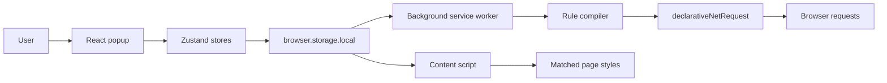

# Echo architecture

Echo is a local-first Manifest V3 browser extension. React renders the popup,
Zustand coordinates reactive state, browser storage persists rules, and the
background service worker translates stored rules into declarative browser
request rules.

## System overview



There is no backend, account system, analytics service, or cloud synchronization.

## Runtime components

### Popup

Location: `entrypoints/popup/`

The popup is responsible for:

- Rendering saved rules
- Collecting and validating rule input
- Creating, editing, deleting, and toggling rules
- Pausing and resuming all interception
- Showing storage errors and explicit enabled state

The popup does not call `declarativeNetRequest` directly. Popup pages are
temporary and disappear when closed, so they are not the owner of active browser
interception state.

### Zustand stores

Locations:

- `store/rules-store.ts`
- `store/interception-store.ts`
- `entrypoints/popup/editor-store.ts`

The rule store coordinates asynchronous persistence and exposes loading, ready,
and error states. Its storage dependency and clock are injected so state behavior
can be tested without Chrome or Brave.

The editor store holds temporary popup editing state. Domain rules remain in the
rule store and persistent browser storage.

### Persistent storage

Locations: `lib/rule-storage.ts`, `lib/interception-storage.ts`

Rules are stored under the `rules` key in `browser.storage.local`. Storage is
local to the browser profile and survives browser exits, computer restarts, and
normal extension updates. Removing the extension or browser profile removes the
data.

The global interception state is stored under `interceptionEnabled` and defaults
to enabled for new and existing installations.

Stored values pass runtime shape checks before they enter application state.
Malformed records are ignored rather than compiled into browser rules.

### Background service worker

Location: `entrypoints/background.ts`

The service worker is the synchronization boundary between persistent rules and
the browser request engine. It requests synchronization:

- When the worker loads
- When Echo is installed or updated
- When the browser starts
- When the local `rules` value changes
- When the local `interceptionEnabled` value changes

Synchronization requests are queued so overlapping storage events cannot race
each other.

### Rule compiler

Location: `lib/rule-compiler.ts`

The compiler is a pure function that:

1. Receives all stored Echo rules.
2. Excludes disabled rules.
3. Assigns deterministic positive numeric browser rule IDs.
4. Converts block, redirect, query-parameter, and request/response-header
   actions to Manifest V3 DNR actions.
5. Adds explicit request resource types for Chrome, Brave, and Firefox
   compatibility.

The explicit resource-type condition is required for reliable matching in Brave
and is protected by regression tests.

### Dynamic-rule synchronization

Location: `lib/rule-sync.ts`

Synchronization reads stored and currently installed dynamic rules concurrently,
then calls `updateDynamicRules` once. Existing Echo dynamic rule IDs are removed
and newly compiled rules are added in the same atomic browser operation.

Dynamic rules are scoped to Echo by the browser. Echo cannot replace another
extension's rules.

### CSS injection

Location: `entrypoints/content.ts`, `lib/css-injection.ts`

A local content script runs on permitted HTTP and HTTPS pages. It reads enabled
CSS rules, matches browser extension page patterns, and creates isolated
`style[data-echo-rule-id]` elements. Storage changes replace Echo-managed styles,
so disabling a rule or globally pausing Echo removes the CSS immediately.

CSS source is stored locally. Echo does not download remote styles or require the
`scripting` permission for this feature.

## Rule data model

Location: `types/rules.ts`

```ts
type InterceptorRule = {
  id: string;
  name: string;
  enabled: boolean;
  urlPattern: string;
  action:
    | { type: 'block' }
    | { type: 'redirect'; targetUrl: string };
  createdAt: string;
  updatedAt: string;
};
```

Application IDs are UUID strings. Browser DNR IDs are generated numeric IDs and
are not persisted as domain data.

## Data flow

### Create or update

```text
Form input
→ validation
→ Zustand saveRule
→ browser.storage.local
→ storage change event
→ background synchronization queue
→ compile enabled rules
→ atomic dynamic-rule replacement
```

### Enable or disable

```text
Switch change
→ update enabled flag and timestamp
→ persist rule
→ resynchronize all enabled rules
```

A disabled rule remains stored but is absent from the browser's dynamic rules.

### Pause or resume all interception

```text
Global switch change
→ persist interceptionEnabled
→ storage change event
→ remove all dynamic rules while paused, or restore enabled rules when resumed
```

Pausing does not modify or delete any individual rule.

### Delete

```text
User confirmation
→ remove stored rule
→ storage change event
→ dynamic-rule replacement without deleted rule
```

## Permissions and trust boundaries

Echo currently requests:

- `storage`
- `declarativeNetRequestWithHostAccess`
- `<all_urls>`

Broad host access is required because redirect rules can target arbitrary
user-selected websites. The browser executes DNR rules without exposing request
or response bodies to Echo.

Security invariants:

- No remote code execution or downloaded scripts
- No backend or telemetry
- No collection of bodies, cookies, authorization headers, or browsing history
- HTTP and HTTPS redirect targets only
- Rule validation before persistence and compilation
- Browser-specific logic isolated behind small typed interfaces

See [`SECURITY.md`](../SECURITY.md) for reporting and disclosure guidance.

## Testing strategy

Unit tests cover:

- URL-pattern and redirect validation
- Storage normalization, saves, updates, and deletion
- Block and redirect compilation
- Explicit request resource types
- Dynamic-rule replacement
- Persistent global pause behavior
- Zustand loading, saving, toggling, deletion, and failures

Browser behavior still requires manual integration testing because unit tests do
not execute Chromium's request engine.

Required verification commands:

```bash
npm test
npm run typecheck
npm run build
```

## Browser support

The current production build targets Chromium Manifest V3 and has been manually
tested in Brave. Chrome, Edge, and Opera share the same underlying extension API
model but still require release testing.

WXT provides a Firefox build path. Firefox support is planned but is not yet a
tested or promised release target. Safari is outside the current MVP scope.

See [`docs/browser-compatibility.md`](./browser-compatibility.md) for the support
matrix and the known Brave DevTools response-header visibility caveat.

## Future boundaries

Manifest V3 can support header and query-parameter transformations, plus
permissioned script/style injection. It cannot reliably delay arbitrary network
traffic or rewrite response bodies. Those capabilities require limited page-level
simulation or a future local proxy companion.

See [`docs/roadmap.md`](./roadmap.md) for the planned capability breakdown.
